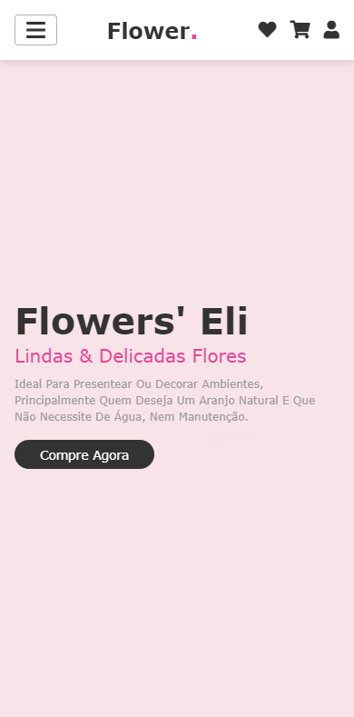
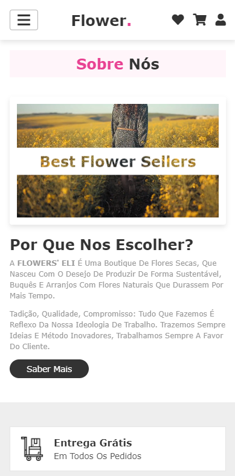
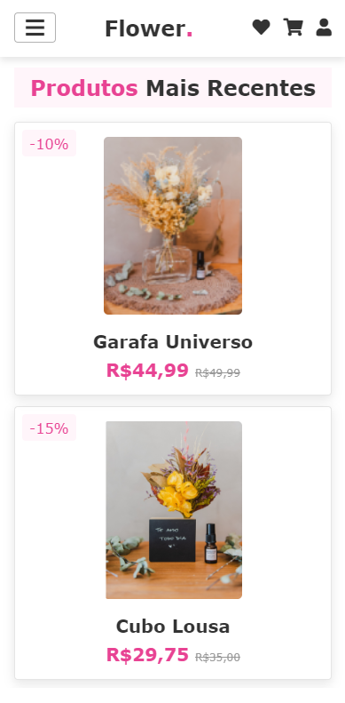
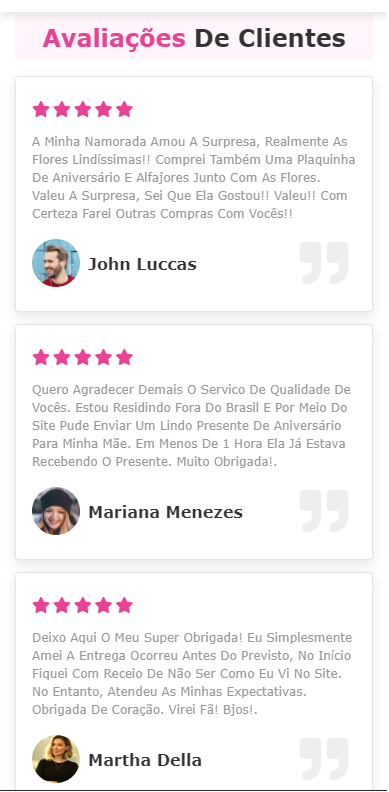
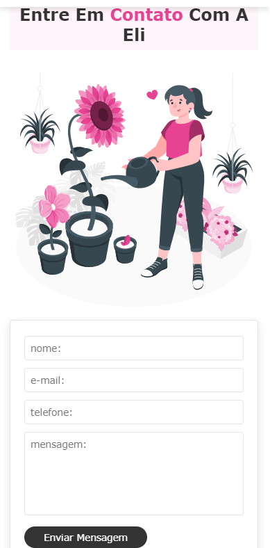
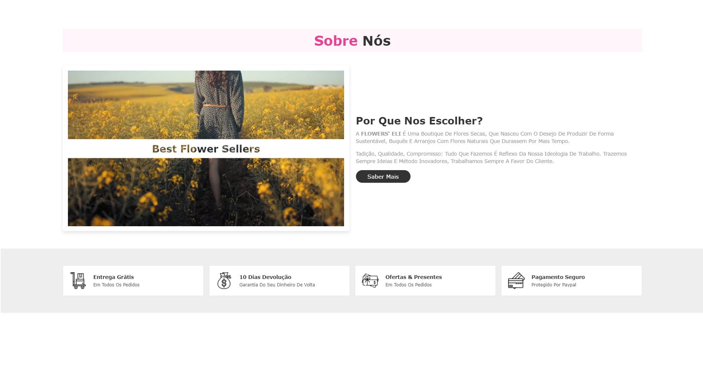
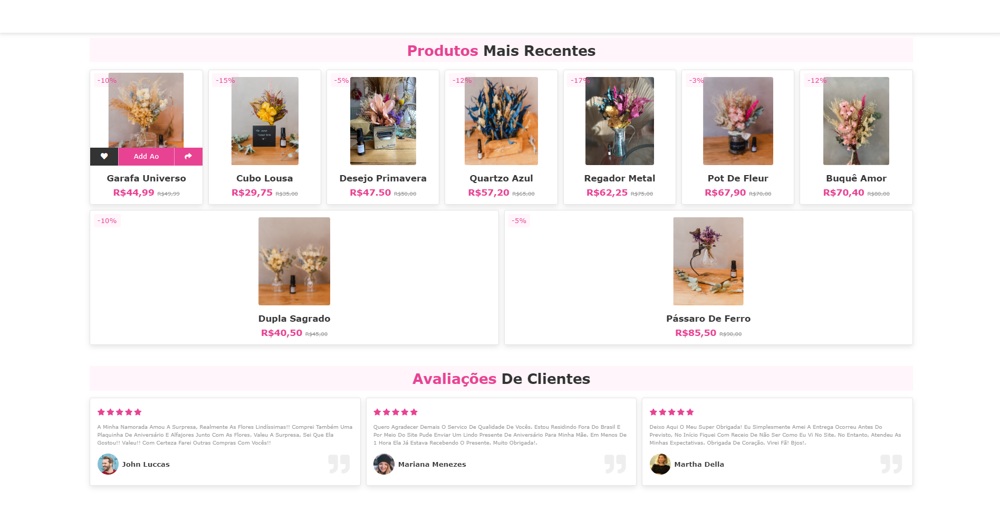
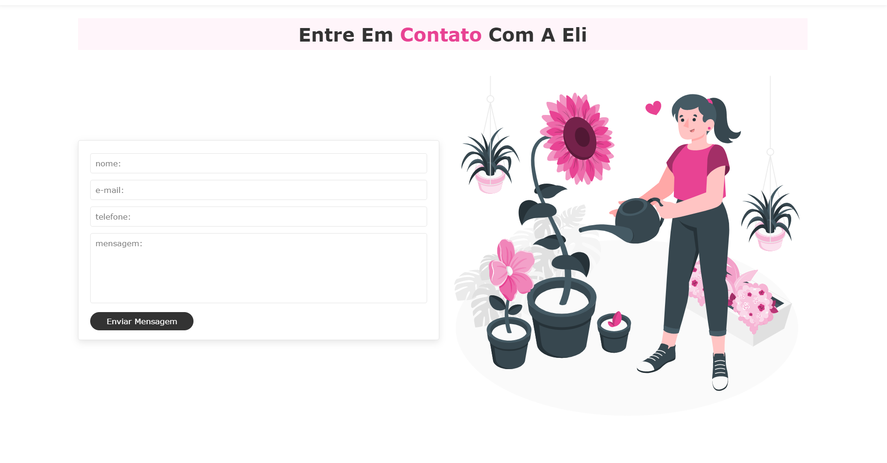

<h1 align="center">
    <br>
    <p align="center" style="color: #e84393; font-weight: bold;">🚀 Landing Page - Flowers' Eli</p>
</h1>

<p align="center">

</p>

<br>

<p align="justify"> <strong> Flowers' Eli</strong> é uma boutique de flores secas, que nasceu com o desejo de produzir de forma sustentável, buquês e arranjos com flores naturais que durassem por mais tempo. Ideal para presentear ou decorar ambientes, principalmente quem deseja um aranjo natural e que não necessite de água, nem manutenção.</p>

<br>

<p align="justify">⚠️Tadição, qualidade, compromisso: tudo que fazemos é reflexo da nossa ideologia de trabalho. Trazemos sempre ideias e método inovadores, trabalhamos sempre a favor do cliente. Um ambiente florido e cheiroso para trabalhar pode diminui o estresse e melhora seu humor e até sua produtividade!!!</p>

<br>

<h1>
    <br>
    <p style="color: #e84393; font-weight: bold;">🧠 Contexto</p>
</h1>

O objetivo foi criar uma landing Page de uma boutique de flores secas ideal para docorar ambientes.

- Link do projeto do Surge
- Tecnologias Utilizadas
- Arquitetura
- Requisitos
- Saudações da Eli!

<br>

<h1>
    <br>
    <p style="color: #e84393; font-weight: bold;">🎨 Layout</p>
</h1>

## Mobile

<p align="center">
     
     
     
     
     
</p>
</p>

---

## Web

<p align="center" style="display: flex; align-items: flex-start; justify-content: center;">
     
     
</p>
<p align="center" style="display: flex; align-items: flex-start; justify-content: center;">
     
     
</p>
---

<h1>
    <br>
    <p style="color: #e84393; font-weight: bold;">🔗 Link do projeto no Surge</p>
</h1>

https://fabulous-join.surge.sh/

<br>

<h1>
    <br>
    <p style="color: #e84393; font-weight: bold;">🔗 Link do projeto no Netlify</p>
</h1>

https://flores-eli-shope.netlify.app

<br>

<h1>
    <br>
    <p style="color: #e84393; font-weight: bold;">🛠️ Tecnologias Utilizadas</p>
</h1>

 <div style="display: inline_block"><br>
 
  
  
  
   
  
 
</div>

<br>

<h1>
    <br>
    <p style="color: #e84393; font-weight: bold;">📁 Arquitetura</p>
</h1>

```
 📁 flower-shop
   |
   |- 📁 css
   |    |- 📑 style.css
   |
   |- 📁 imagens
   |    |- 📑 varias_imagem ...
   |
   |- 📁 js
   |    |- 📑 main.js
   |
   |- 📑 index.html
   |- 📑 README.md

```

<br>

<h1>
    <br>
    <p style="color: #e84393; font-weight: bold;">⚙️ Requisitos</p>
</h1>

A página deve :

- Ser responsiva no geral mas testada especificamente no iPhone 6/7/8 (essa opção é facilmente testada, usando o DevTools do Chrome) para a versão mobile. Para a versão desktop terá que ser testado em uma tela de 1280px de largura.
- Seguir semântica do HTML5, ou seja, sempre que fizer sentido usar as tags semânticas no lugar de divs. Exemplos de tags semânticas: `<header>`, `<nav>`, `<main>` , `<footer>`, entre outras.
- Links com ícone para as redes sociais (de mentirinha, pode apontar para a página inicial da rede social) contendo [Twitter](https://twitter.com/login?lang=pt), [Facebook](https://pt-br.facebook.com/) e [Instagram](https://www.instagram.com/).
- O CSS deve estar em um, ou mais, arquivo(s) separado(s) e com comentários indicando a que parte do layout as regras se referem.
- Seguir uma paleta de cores baseada na logomarca provida pelo cliente.
- Conter, **pelo menos**, 2 seções diferentes.
  - Sugestões de Seção (você **não precisa** se limitar a elas)
    - Quem somos
    - Nossos produtos/serviços
    - Contato
    - Nosso time
    - Trabalhe conosco
    - Cases de sucesso
    - Onde estamos
    - FAQ/Perguntas Frequentes
    - Promoções

<br>

<h1>
    <br>
    <p style="color: #e84393; font-weight: bold;">👋 Saudações, Eli!</p>
</h1>

_Caso queira contribuir com meu projeto, será totalmente bem-vindx!!!_
_Qualquer dúvida ou sugestão, chama no contatinho!_

 

### Vamos nos conectar!

- [LinkedIn](https://www.linkedin.com/in/elisabete-a-santos/)
- [GitHub](https://github.com/elisabetealves)

<br>

### Feito com 💕 e muita dedicação

<br>

<h1>
    <br>
    <p style="color: #e84393; font-weight: bold;s">📝 Licença</p>
</h1>

Este projeto esta sob a licença [MIT](./LICENSE).

<br>

<h3>
  <a href='#top'>🔝 Voltar para o topo.</a>
</h3>

<br>
